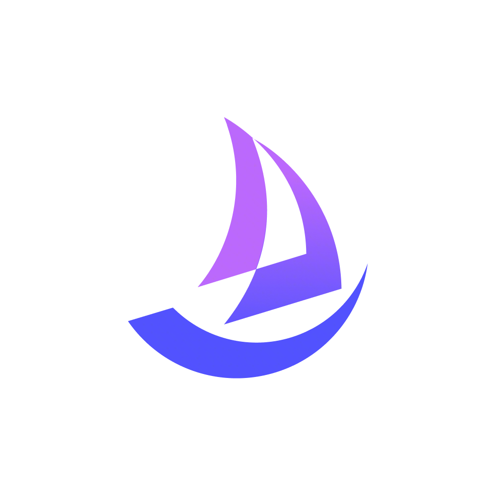

<div align="center">
<a href="https://openviking.ai/" target="_blank">
  <picture>
    
  </picture>
</a>

### OpenViking：AI 智能体的上下文数据库

[English](README.md) / 中文 / [日本語](README_JA.md)

<a href="https://www.openviking.ai">官网</a> · <a href="https://github.com/volcengine/OpenViking">GitHub</a> · <a href="https://github.com/volcengine/OpenViking/issues">问题反馈</a> · <a href="https://www.openviking.ai/docs">文档</a>

[![][release-shield]][release-link]
[![][github-stars-shield]][github-stars-link]
[![][github-issues-shield]][github-issues-shield-link]
[![][github-contributors-shield]][github-contributors-link]
[![][license-shield]][license-shield-link]
[![][last-commit-shield]][last-commit-shield-link]


👋 加入我们的社区

📱 <a href="./docs/en/about/01-about-us.md#lark-group">飞书群</a> · <a href="./docs/en/about/01-about-us.md#wechat-group">微信群</a> · <a href="https://discord.com/invite/eHvx8E9XF3">Discord</a> · <a href="https://x.com/openvikingai">X</a>

</div>

---

## 概述

### 智能体开发面临的挑战

在 AI 时代，数据丰富，但高质量的上下文却难以获得。在构建 AI 智能体时，开发者经常面临以下挑战：

- **上下文碎片化**：记忆存储在代码中，资源在向量数据库中，技能分散在各处，难以统一管理。
- **上下文需求激增**：智能体的长运行任务在每次执行时都会产生上下文。简单的截断或压缩会导致信息丢失。
- **检索效果不佳**：传统 RAG 使用扁平化存储，缺乏全局视图，难以理解信息的完整上下文。
- **上下文不可观察**：传统 RAG 的隐式检索链像黑盒，出错时难以调试。
- **记忆迭代有限**：当前记忆只是用户交互的记录，缺乏智能体相关的任务记忆。

### OpenViking 解决方案

**OpenViking** 是专为 AI 智能体设计的开源**上下文数据库**。

我们的目标是为智能体定义一个极简的上下文交互范式，让开发者完全告别上下文管理的烦恼。OpenViking 抛弃了传统 RAG 的碎片化向量存储模型，创新性地采用 **"文件系统范式"** 来统一组织智能体所需的记忆、资源和技能。

使用 OpenViking，开发者可以像管理本地文件一样构建智能体的大脑：

- **文件系统管理范式** → **解决碎片化**：基于文件系统范式统一管理记忆、资源和技能。
- **分层上下文加载** → **降低 Token 消耗**：L0/L1/L2 三层结构，按需加载，显著节省成本。
- **目录递归检索** → **提升检索效果**：支持原生文件系统检索方式，结合目录定位和语义搜索，实现递归精准的上下文获取。
- **可视化检索轨迹** → **可观察上下文**：支持目录检索轨迹可视化，让用户清晰观察问题根源，指导检索逻辑优化。
- **自动会话管理** → **上下文自迭代**：自动压缩对话中的内容、资源引用、工具调用等，提取长期记忆，让智能体越用越聪明。

---

## 快速开始

### 前置条件

在开始使用 OpenViking 之前，请确保您的环境满足以下要求：

- **Python 版本**：3.10 或更高版本
- **Go 版本**：1.22 或更高（从源码构建 AGFS 组件需要）
- **C++ 编译器**：GCC 9+ 或 Clang 11+（构建核心扩展需要，必须支持 C++17）
- **操作系统**：Linux、macOS、Windows
- **网络连接**：需要稳定的网络连接（用于下载依赖和访问模型服务）

### 1. 安装

#### Python 包

```bash
pip install openviking --upgrade --force-reinstall
```

#### Rust CLI（可选）

```bash
curl -fsSL https://raw.githubusercontent.com/volcengine/OpenViking/main/crates/ov_cli/install.sh | bash
```

或从源码构建：

```bash
cargo install --git https://github.com/volcengine/OpenViking ov_cli
```

### 2. 模型准备

OpenViking 需要以下模型能力：
- **VLM 模型**：用于图像和内容理解
- **Embedding 模型**：用于向量化和语义检索

#### 支持的 VLM 提供商

OpenViking 支持三种 VLM 提供商：

| 提供商 | 描述 | 获取 API Key |
|----------|-------------|-------------|
| `volcengine` | 火山引擎豆包模型 | [Volcengine 控制台](https://console.volcengine.com/ark/region:ark+cn-beijing/overview?briefPage=0&briefType=introduce&type=new&utm_content=OpenViking&utm_medium=devrel&utm_source=OWO&utm_term=OpenViking) |
| `openai` | OpenAI 官方 API | [OpenAI 平台](https://platform.openai.com) |
| `azure` | Azure OpenAI 服务 | [Azure OpenAI 服务](https://portal.azure.com) |
| `litellm` | 统一调用多种第三方模型 (Anthropic, DeepSeek, Gemini, vLLM, Ollama 等) | 参见 [LiteLLM 提供商](https://docs.litellm.ai/docs/providers) |

> 💡 **提示**：
> - `litellm` 支持通过统一接口调用多种模型，model 字段需遵循 [LiteLLM 格式规范](https://docs.litellm.ai/docs/providers)
> - 系统自动检测常见模型（如 `claude-*`, `deepseek-*`, `gemini-*`, `hosted_vllm/*`, `ollama/*` 等），其他模型需按 LiteLLM 格式填写完整前缀

#### 提供商特定说明

<details>
<summary><b>Volcengine (豆包)</b></summary>

Volcengine 支持模型名称和端点 ID。为简单起见，建议使用模型名称：

```json
{
  "vlm": {
    "provider": "volcengine",
    "model": "doubao-seed-2-0-pro-260215",
    "api_key": "your-api-key",
    "api_base": "https://ark.cn-beijing.volces.com/api/v3"
  }
}
```

您也可以使用端点 ID（可在 [Volcengine ARK 控制台](https://console.volcengine.com/ark) 中找到）：

```json
{
  "vlm": {
    "provider": "volcengine",
    "model": "ep-20241220174930-xxxxx",
    "api_key": "your-api-key",
    "api_base": "https://ark.cn-beijing.volces.com/api/v3"
  }
}
```

</details>

<details>
<summary><b>OpenAI</b></summary>

使用 OpenAI 的官方 API：

```json
{
  "vlm": {
    "provider": "openai",
    "model": "gpt-4o",
    "api_key": "your-api-key",
    "api_base": "https://api.openai.com/v1"
  }
}
```

您也可以使用自定义的 OpenAI 兼容端点：

```json
{
  "vlm": {
    "provider": "openai",
    "model": "gpt-4o",
    "api_key": "your-api-key",
    "api_base": "https://your-custom-endpoint.com/v1"
  }
}
```

</details>

<details>
<summary><b>Azure OpenAI</b></summary>

使用 Azure OpenAI 服务。`model` 字段需要填写 Azure 上的**部署名称（deployment name）**，而非模型官方名字：

```json
{
  "vlm": {
    "provider": "azure",
    "model": "your-deployment-name",
    "api_key": "your-azure-api-key",
    "api_base": "https://your-resource-name.openai.azure.com",
    "api_version": "2025-01-01-preview"
  }
}
```

> 💡 **提示**：
> - `api_base` 填写你的 Azure OpenAI 资源端点，支持 `*.openai.azure.com` 和 `*.cognitiveservices.azure.com` 两种格式
> - `api_version` 可选，默认值为 `2025-01-01-preview`
> - `model` 必须与 Azure Portal 中创建的部署名称一致

</details>

<details>
<summary><b>LiteLLM (Anthropic, DeepSeek, Gemini, Qwen, vLLM, Ollama 等)</b></summary>

LiteLLM 提供对各种模型的统一访问。`model` 字段应遵循 LiteLLM 的命名约定。以下以 Claude 和 Qwen 为例：

**Anthropic:**

```json
{
  "vlm": {
    "provider": "litellm",
    "model": "claude-3-5-sonnet-20240620",
    "api_key": "your-anthropic-api-key"
  }
}
```

**Qwen (DashScope)：**

```json
{
  "vlm": {
    "provider": "litellm",
    "model": "dashscope/qwen-turbo",
    "api_key": "your-dashscope-api-key",
    "api_base": "https://dashscope.aliyuncs.com/compatible-mode/v1"
  }
}
```

> 💡 **Qwen 提示**：
> - **中国/北京** 区域，使用 `api_base`：`https://dashscope.aliyuncs.com/compatible-mode/v1`
> - **国际** 区域，使用 `api_base`：`https://dashscope-intl.aliyuncs.com/compatible-mode/v1`

**常见模型格式：**

| 提供商 | 模型示例 | 说明 |
|----------|---------------|-------|
| Anthropic | `claude-3-5-sonnet-20240620` | 自动检测，使用 `ANTHROPIC_API_KEY` |
| DeepSeek | `deepseek-chat` | 自动检测，使用 `DEEPSEEK_API_KEY` |
| Gemini | `gemini-pro` | 自动检测，使用 `GEMINI_API_KEY` |
| Qwen | `dashscope/qwen-turbo` | 根据区域设置 `api_base`（见上方说明） |
| OpenRouter | `openrouter/openai/gpt-4o` | 需要完整前缀 |
| vLLM | `hosted_vllm/llama-3.1-8b` | 设置 `api_base` 为 vLLM 服务器 |
| Ollama | `ollama/llama3.1` | 设置 `api_base` 为 Ollama 服务器 |

**本地模型 (vLLM / Ollama)：**

```bash

# 启动 Ollama
ollama serve
```

```json
// Ollama
{
  "vlm": {
    "provider": "litellm",
    "model": "ollama/llama3.1",
    "api_base": "http://localhost:11434"
  }
}
```

完整的模型支持，请参见 [LiteLLM 提供商文档](https://docs.litellm.ai/docs/providers)。

</details>

### 3. 环境配置

#### 服务器配置模板

创建配置文件 `~/.openviking/ov.conf`，复制前请删除注释：

```json
{
  "storage": {
    "workspace": "/home/your-name/openviking_workspace"
  },
  "log": {
    "level": "INFO",
    "output": "stdout"                 // 日志输出："stdout" 或 "file"
  },
  "embedding": {
    "dense": {
      "api_base" : "<api-endpoint>",   // API 端点地址
      "api_key"  : "<your-api-key>",   // 模型服务 API Key
      "provider" : "<provider-type>",  // 提供商类型："volcengine"、"openai"、"azure" 等
      "api_version": "2025-01-01-preview", // （仅 azure）API 版本，可选，默认 "2025-01-01-preview"
      "dimension": 1024,               // 向量维度
      "model"    : "<model-name>"      // Embedding 模型名称或 Azure 部署名（如 doubao-embedding-vision-250615 或 text-embedding-3-large）
    },
    "max_concurrent": 10               // 最大并发 embedding 请求（默认：10）
  },
  "vlm": {
    "api_base" : "<api-endpoint>",     // API 端点地址
    "api_key"  : "<your-api-key>",     // 模型服务 API Key
    "provider" : "<provider-type>",    // 提供商类型 (volcengine, openai, azure, litellm 等)
    "api_version": "2025-01-01-preview", // （仅 azure）API 版本，可选，默认 "2025-01-01-preview"
    "model"    : "<model-name>",       // VLM 模型名称或 Azure 部署名（如 doubao-seed-2-0-pro-260215 或 gpt-4-vision-preview）
    "max_concurrent": 100              // 语义处理的最大并发 LLM 调用（默认：100）
  }
}
```

> **注意**：对于 embedding 模型，目前支持 `volcengine`（豆包）、`openai`、`azure`、`jina` 等提供商。对于 VLM 模型，我们支持 `volcengine`、`openai`、`azure` 和 `litellm` 提供商。`litellm` 提供商支持各种模型，包括 Anthropic (Claude)、DeepSeek、Gemini、Moonshot、Zhipu、DashScope、MiniMax、vLLM、Ollama 等。

#### 服务器配置示例

👇 展开查看您的模型服务的配置示例：

<details>
<summary><b>示例 1：使用 Volcengine（豆包模型）</b></summary>

```json
{
  "storage": {
    "workspace": "/home/your-name/openviking_workspace"
  },
  "log": {
    "level": "INFO",
    "output": "stdout"                 // 日志输出："stdout" 或 "file"
  },
  "embedding": {
    "dense": {
      "api_base" : "https://ark.cn-beijing.volces.com/api/v3",
      "api_key"  : "your-volcengine-api-key",
      "provider" : "volcengine",
      "dimension": 1024,
      "model"    : "doubao-embedding-vision-250615"
    },
    "max_concurrent": 10
  },
  "vlm": {
    "api_base" : "https://ark.cn-beijing.volces.com/api/v3",
    "api_key"  : "your-volcengine-api-key",
    "provider" : "volcengine",
    "model"    : "doubao-seed-2-0-pro-260215",
    "max_concurrent": 100
  }
}
```

</details>

<details>
<summary><b>示例 2：使用 OpenAI 模型</b></summary>

```json
{
  "storage": {
    "workspace": "/home/your-name/openviking_workspace"
  },
  "log": {
    "level": "INFO",
    "output": "stdout"                 // 日志输出："stdout" 或 "file"
  },
  "embedding": {
    "dense": {
      "api_base" : "https://api.openai.com/v1",
      "api_key"  : "your-openai-api-key",
      "provider" : "openai",
      "dimension": 3072,
      "model"    : "text-embedding-3-large"
    },
    "max_concurrent": 10
  },
  "vlm": {
    "api_base" : "https://api.openai.com/v1",
    "api_key"  : "your-openai-api-key",
    "provider" : "openai",
    "model"    : "gpt-4-vision-preview",
    "max_concurrent": 100
  }
}
```

</details>

<details>
<summary><b>示例 3：使用 Azure OpenAI 模型</b></summary>

```json
{
  "storage": {
    "workspace": "/home/your-name/openviking_workspace"
  },
  "log": {
    "level": "INFO",
    "output": "stdout"
  },
  "embedding": {
    "dense": {
      "api_base" : "https://your-resource-name.openai.azure.com",
      "api_key"  : "your-azure-api-key",
      "provider" : "azure",
      "api_version": "2025-01-01-preview",
      "dimension": 1024,
      "model"    : "text-embedding-3-large"
    },
    "max_concurrent": 10
  },
  "vlm": {
    "api_base" : "https://your-resource-name.openai.azure.com",
    "api_key"  : "your-azure-api-key",
    "provider" : "azure",
    "api_version": "2025-01-01-preview",
    "model"    : "gpt-4o",
    "max_concurrent": 100
  }
}
```

> 💡 **提示**：
> - `model` 必须填写 Azure Portal 中创建的**部署名称**，而非模型官方名字
> - `api_base` 支持 `*.openai.azure.com` 和 `*.cognitiveservices.azure.com` 两种端点格式
> - Embedding 和 VLM 可以使用不同的 Azure 资源和 API Key

</details>

#### 设置服务器配置环境变量

创建配置文件后，设置环境变量指向它（Linux/macOS）：

```bash
export OPENVIKING_CONFIG_FILE=~/.openviking/ov.conf # 默认值
```

在 Windows 上，使用以下任一方式：

PowerShell：

```powershell
$env:OPENVIKING_CONFIG_FILE = "$HOME/.openviking/ov.conf"
```

命令提示符 (cmd.exe)：

```bat
set "OPENVIKING_CONFIG_FILE=%USERPROFILE%\.openviking\ov.conf"
```

> 💡 **提示**：您也可以将配置文件放在其他位置，只需在环境变量中指定正确路径。

#### CLI/客户端配置示例

👇 展开查看您的 CLI/客户端的配置示例：

示例：用于访问本地服务器的 ovcli.conf

```json
{
  "url": "http://localhost:1933",
  "timeout": 60.0,
  "output": "table"
}
```

创建配置文件后，设置环境变量指向它（Linux/macOS）：

```bash
export OPENVIKING_CLI_CONFIG_FILE=~/.openviking/ovcli.conf # 默认值
```

在 Windows 上，使用以下任一方式：

PowerShell：

```powershell
$env:OPENVIKING_CLI_CONFIG_FILE = "$HOME/.openviking/ovcli.conf"
```

命令提示符 (cmd.exe)：

```bat
set "OPENVIKING_CLI_CONFIG_FILE=%USERPROFILE%\.openviking\ovcli.conf"
```

### 4. 运行您的第一个示例

> 📝 **前置条件**：确保您已完成上一步的配置（ov.conf 和 ovcli.conf）。

现在让我们运行一个完整的示例，体验 OpenViking 的核心功能。

#### 启动服务器

```bash
openviking-server
```

或者您可以在后台运行

```bash
nohup openviking-server > /data/log/openviking.log 2>&1 &
```

#### 运行 CLI

```bash
ov status
ov add-resource https://github.com/volcengine/OpenViking # --wait
ov ls viking://resources/
ov tree viking://resources/volcengine -L 2
# 如果没有使用 --wait，等待一段时间以进行语义处理
ov find "what is openviking"
ov grep "openviking" --uri viking://resources/volcengine/OpenViking/docs/zh
```

恭喜！您已成功运行 OpenViking 🎉

### VikingBot 快速开始

VikingBot 是构建在 OpenViking 之上的 AI 智能体框架。以下是快速开始指南：

```bash
# 选项 1：从 PyPI 安装 VikingBot（推荐大多数用户使用）
pip install "openviking[bot]"

# 选项 2：从源码安装 VikingBot（用于开发）
uv pip install -e ".[bot]"

# 启动 OpenViking 服务器（同时启动 Bot）
openviking-server --with-bot

# 在另一个终端启动交互式聊天
ov chat
```

---

## 服务器部署详情

对于生产环境，我们建议将 OpenViking 作为独立的 HTTP 服务运行，为您的 AI 智能体提供持久、高性能的上下文支持。

🚀 **在云端部署 OpenViking**：
为确保最佳的存储性能和数据安全，我们建议在 **火山引擎弹性计算服务 (ECS)** 上使用 **veLinux** 操作系统进行部署。我们准备了详细的分步指南，帮助您快速上手。

👉 **[查看：服务器部署与 ECS 设置指南](./docs/zh/getting-started/03-quickstart-server.md)**


## OpenClaw 上下文插件详情

* 测试集：基于 LoCoMo10(https://github.com/snap-research/locomo) 的长程对话进行效果测试（去除无真值的 category5 后，共 1540 条 case）
* 实验组：因用户在使用 OpenViking 时可能不关闭 OpenClaw 原生记忆，所以增加是否开关原生记忆的实验组
* OpenViking 版本：0.1.18
* 模型：seed-2.0-code
* 评测脚本：https://github.com/ZaynJarvis/openclaw-eval/tree/main

| 实验组 |	任务完成率 | 成本：输入 token (总计) |
|----------|------------------|------------------|
| OpenClaw(memory-core) |	35.65% |	24,611,530 |
| OpenClaw + LanceDB (-memory-core) |	44.55% |	51,574,530 |
| OpenClaw + OpenViking Plugin (-memory-core)	| 52.08% |	4,264,396 |
| OpenClaw + OpenViking Plugin (+memory-core)	| 51.23% |	2,099,622 |

* 实验结论：
结合 OpenViking 后，若仍开启原生记忆，效果在原 OpenClaw 上提升 43%，输入 token 成本降低 91%；在 LanceDB 上效果提升 15%，输入 token 降低 96%。若关闭原生记忆，效果在原 OpenClaw 上提升 49%，输入 token 成本降低 83%；在 LanceDB 上效果提升 17%，输入 token 降低 92%。

👉 **[查看：OpenClaw 上下文插件](examples/openclaw-plugin/README_CN.md)**

👉 **[查看：OpenCode 记忆插件示例](examples/opencode-memory-plugin/README_CN.md)**

👉 **[查看：Claude Code 记忆插件示例](examples/claude-code-memory-plugin/README_CN.md)**

## VikingBot 部署详情

OpenViking 有一个类似 nanobot 的机器人用于交互工作，现已可用。

👉 **[查看：使用 VikingBot 部署服务器](bot/README_CN.md)**

--

## 核心概念

运行第一个示例后，让我们深入了解 OpenViking 的设计理念。这五个核心概念与前面提到的解决方案一一对应，共同构建了一个完整的上下文管理系统：

### 1. 文件系统管理范式 → 解决碎片化

我们不再将上下文视为扁平的文本切片，而是将它们统一到一个抽象的虚拟文件系统中。无论是记忆、资源还是能力，都映射到 `viking://` 协议下的虚拟目录中，每个都有唯一的 URI。

这种范式赋予智能体前所未有的上下文操作能力，使它们能够像开发者一样，通过 `ls` 和 `find` 等标准命令精确、确定地定位、浏览和操作信息。这将上下文管理从模糊的语义匹配转变为直观、可追踪的"文件操作"。了解更多：[Viking URI](./docs/zh/concepts/04-viking-uri.md) | [上下文类型](./docs/zh/concepts/02-context-types.md)

```
viking://
├── resources/              # 资源：项目文档、代码库、网页等
│   ├── my_project/
│   │   ├── docs/
│   │   │   ├── api/
│   │   │   └── tutorials/
│   │   └── src/
│   └── ...
├── user/                   # 用户：个人偏好、习惯等
│   └── memories/
│       ├── preferences/
│       │   ├── writing_style
│       │   └── coding_habits
│       └── ...
└── agent/                  # 智能体：技能、指令、任务记忆等
    ├── skills/
    │   ├── search_code
    │   ├── analyze_data
    │   └── ...
    ├── memories/
    └── instructions/
```

### 2. 分层上下文加载 → 降低 Token 消耗

一次性将大量上下文塞入提示不仅昂贵，而且容易超出模型窗口并引入噪声。OpenViking 在写入时自动将上下文处理为三个级别：
- **L0 (摘要)**：一句话摘要，用于快速检索和识别。
- **L1 (概览)**：包含核心信息和使用场景，用于智能体在规划阶段的决策。
- **L2 (详情)**：完整的原始数据，供智能体在绝对必要时深度阅读。

了解更多：[上下文分层](./docs/zh/concepts/03-context-layers.md)

```
viking://resources/my_project/
├── .abstract               # L0 层：摘要（~100 tokens）- 快速相关性检查
├── .overview               # L1 层：概览（~2k tokens）- 理解结构和关键点
├── docs/
│   ├── .abstract          # 每个目录都有对应的 L0/L1 层
│   ├── .overview
│   ├── api/
│   │   ├── .abstract
│   │   ├── .overview
│   │   ├── auth.md        # L2 层：完整内容 - 按需加载
│   │   └── endpoints.md
│   └── ...
└── src/
    └── ...
```

### 3. 目录递归检索 → 提升检索效果

单一向量检索难以应对复杂的查询意图。OpenViking 设计了创新的**目录递归检索策略**，深度集成多种检索方法：

1. **意图分析**：通过意图分析生成多个检索条件。
2. **初始定位**：使用向量检索快速定位初始切片所在的高分目录。
3. **精细探索**：在该目录内进行二次检索，并将高分结果更新到候选集。
4. **递归深入**：如果存在子目录，则逐层递归重复二次检索步骤。
5. **结果聚合**：最终获取最相关的上下文返回。

这种"先锁定高分目录，再精细化内容探索"的策略不仅找到语义最佳匹配的片段，还能理解信息所在的完整上下文，从而提高检索的全局性和准确性。了解更多：[检索机制](./docs/zh/concepts/07-retrieval.md)

### 4. 可视化检索轨迹 → 可观察上下文

OpenViking 的组织采用分层虚拟文件系统结构。所有上下文以统一格式集成，每个条目对应一个唯一的 URI（如 `viking://` 路径），打破了传统的扁平黑盒管理模式，具有清晰易懂的层次结构。

检索过程采用目录递归策略。每次检索的目录浏览和文件定位轨迹被完整保留，让用户能够清晰观察问题的根源，指导检索逻辑的优化。了解更多：[检索机制](./docs/zh/concepts/07-retrieval.md)

### 5. 自动会话管理 → 上下文自迭代

OpenViking 内置了记忆自迭代循环。在每个会话结束时，开发者可以主动触发记忆提取机制。系统将异步分析任务执行结果和用户反馈，并自动更新到用户和智能体记忆目录。

- **用户记忆更新**：更新与用户偏好相关的记忆，使智能体响应更好地适应用户需求。
- **智能体经验积累**：从任务执行经验中提取操作技巧和工具使用经验等核心内容，辅助后续任务的高效决策。

这使得智能体能够通过与世界的交互"越用越聪明"，实现自我进化。了解更多：[会话管理](./docs/zh/concepts/08-session.md)

---

## 深入阅读

### 文档

更多详情，请访问我们的[完整文档](./docs/zh/)。

### 社区与团队

更多详情，请参见：**[关于我们](./docs/zh/about/01-about-us.md)**

### 加入社区

OpenViking 仍处于早期阶段，有许多改进和探索的空间。我们真诚邀请每一位对 AI 智能体技术充满热情的开发者：

- 为我们点亮一颗珍贵的 **Star**，给我们前进的动力。
- 访问我们的[**官网**](https://www.openviking.ai)了解我们传达的理念，并通过[**文档**](https://www.openviking.ai/docs)在您的项目中使用它。感受它带来的变化，并给我们最真实的体验反馈。
- 加入我们的社区，分享您的见解，帮助回答他人的问题，共同创造开放互助的技术氛围：
  - 📱 **飞书群**：扫码加入 → [查看二维码](./docs/en/about/01-about-us.md#lark-group)
  - 💬 **微信群**：扫码添加助手 → [查看二维码](./docs/en/about/01-about-us.md#wechat-group)
  - 🎮 **Discord**：[加入 Discord 服务器](https://discord.com/invite/eHvx8E9XF3)
  - 🐦 **X (Twitter)**：[关注我们](https://x.com/openvikingai)
- 成为**贡献者**，无论是提交错误修复还是贡献新功能，您的每一行代码都将是 OpenViking 成长的重要基石。

让我们共同努力，定义和构建 AI 智能体上下文管理的未来。旅程已经开始，期待您的参与！

### Star 趋势

[](https://www.star-history.com/#volcengine/OpenViking&type=timeline&legend=top-left)

## 许可证

OpenViking 项目不同组件采用不同的开源协议：

- **主项目**: AGPLv3 - 详情请参见 [LICENSE](./LICENSE) 文件
- **crates/ov_cli**: Apache 2.0 - 详情请参见 [LICENSE](./crates/ov_cli/LICENSE) 文件
- **examples**: Apache 2.0 - 详情请参见 [LICENSE](./examples/LICENSE) 文件
- **third_party**: 保留各三方项目的原有协议


<!-- Link Definitions -->

[release-shield]: https://img.shields.io/github/v/release/volcengine/OpenViking?color=369eff&labelColor=black&logo=github&style=flat-square
[release-link]: https://github.com/volcengine/OpenViking/releases
[license-shield]: https://img.shields.io/badge/license-AGPLv3-white?labelColor=black&style=flat-square
[license-shield-link]: https://github.com/volcengine/OpenViking/blob/main/LICENSE
[last-commit-shield]: https://img.shields.io/github/last-commit/volcengine/OpenViking?color=c4f042&labelColor=black&style=flat-square
[last-commit-shield-link]: https://github.com/volcengine/OpenViking/commcommits/main
[github-stars-shield]: https://img.shields.io/github/stars/volcengine/OpenViking?labelColor&style=flat-square&color=ffcb47
[github-stars-link]: https://github.com/volcengine/OpenViking
[github-issues-shield]: https://img.shields.io/github/issues/volcengine/OpenViking?labelColor=black&style=flat-square&color=ff80eb
[github-issues-shield-link]: https://github.com/volcengine/OpenViking/issues
[github-contributors-shield]: https://img.shields.io/github/contributors/volcengine/OpenViking?color=c4f042&labelColor=black&style=flat-square
[github-contributors-link]: https://github.com/volcengine/OpenViking/graphs/contributors
